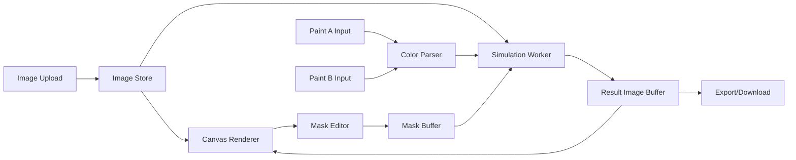

# Technical Design Document: ChromaMatch

**Version:** 0.3  
**Status:** Draft for review  
**Source Docs:** `PRD.md`, `ROADMAP.md`  
**Audience:** Solo developer/founder, future contributors  

---

## 1. Executive Summary

ChromaMatch is a browser-based paint visualization app that lets a user upload a room photo, identify the current wall paint color, manually mask the wall, choose a target color, and render a realistic paint simulation that preserves the original room's lighting, shadows, and texture.

The technical design prioritizes a fidelity-first, local-first MVP:

- Run image processing in the browser for privacy and responsiveness.
- Use canvas-based masking and rendering for the first version.
- Implement LAB D50 color conversion and LAB delta transfer in the MVP.
- Require manual RGB and LRV input for Paint A and Paint B in the MVP.
- Keep RGB ratio only as an optional debug/reference mode, not the main product algorithm.
- Keep automatic segmentation behind a clean boundary so SAM can be introduced later without replacing manual masking.

---

## 2. Goals

### Product Goals

- Let users complete the full MVP flow: upload, define Paint A, mask, choose Paint B, visualize, export.
- Preserve shadows, highlights, and wall texture from the original photo.
- Support cross-brand color comparison through manual RGB and LRV input first, then a catalog later.
- Keep uploaded images private by default.

### Engineering Goals

- Provide deterministic, testable color and pixel transform utilities.
- Keep rendering interactive on common desktop-size uploads.
- Make LAB D50 delta transfer the default simulation engine.
- Validate manual paint inputs by checking RGB-derived luminance against provided LRV.
- Keep manual masking available even after auto-segmentation is added.
- Avoid early backend complexity unless required by segmentation, accounts, or analytics.

---

## 3. Non-Goals

- No 3D room reconstruction.
- No AR placement.
- No automatic paint color detection from unknown walls in the MVP.
- No hosted user accounts or cloud project sync in the MVP.
- No full commercial paint catalog in the first implementation.
- No SAM integration in Phase 1.

---

## 4. Recommended Technical Stack

This repository currently contains only planning documents, so the app stack is still open. ChromaMatch should be **web-first**: the first production-quality client should run in a desktop/mobile browser, with image upload, masking, simulation, and export happening locally in the user's browser. This does not prevent a Kotlin backend later; it simply avoids backend complexity until server-side segmentation, accounts, catalogs, or analytics require it.

Accepted MVP default for a solo developer with backend/Kotlin experience:

| Layer | Recommendation | Rationale |
| --- | --- | --- |
| Language | TypeScript | Closest mainstream FE equivalent to Kotlin's type-safety mindset |
| App framework | Vite + React | Fast setup, broad ecosystem, good fit for a single-page canvas-heavy app |
| Styling | Tailwind CSS | Fast UI iteration, no runtime styling dependency |
| UI primitives | shadcn/ui + Radix-style components | Modern accessible components that remain owned in the repo |
| Icons | lucide-react | Simple, popular icon set with good React ergonomics |
| Rendering | HTML Canvas 2D | Best fit for pixel transforms, brush masks, and export |
| State | React reducer/context first; Zustand only if state grows | Keeps the MVP understandable; avoids premature state architecture |
| Pixel processing | Web Worker + typed arrays | Keeps simulation transforms off the main UI thread |
| Tests | Vitest + Playwright | Unit coverage for color math, browser coverage for canvas workflow |
| Persistence | Browser memory + local export first | Avoids backend until beta needs accounts, catalogs, or analytics |
| Backend, later | Kotlin Ktor or Spring Boot | Only needed for SAM hosting, paint catalog API, accounts, or analytics |
| Deployment | Static hosting for MVP | Local image processing means no app server required initially |

### Why Not Next.js First?

Next.js is a strong React framework, especially when server rendering, file-based routing, hosted APIs, auth, and backend-for-frontend patterns are core to the product. ChromaMatch's MVP is closer to a local, canvas-heavy creative tool than a content or server-rendered web app. Vite + React keeps the first build smaller and easier to reason about.

Next.js should be reconsidered if:

- SEO or public content pages become important.
- The app needs integrated backend routes early.
- Authentication and account-based project storage become MVP requirements.
- The frontend becomes a multi-route product surface rather than one focused editor.

### Why Not Kotlin Multiplatform or Compose First?

Kotlin-native options would feel familiar, but the browser gives ChromaMatch the fastest path to:

- User photo upload without app store distribution.
- Canvas-based image editing.
- Easy sharing and demos.
- Static deployment.
- A future Kotlin backend without committing the client to native mobile.

**Decision:** ChromaMatch will start as a browser-based MVP using Vite, React, TypeScript, Tailwind CSS, Canvas 2D, Web Workers, Vitest, and Playwright. A Kotlin backend remains a good later option for SAM segmentation, catalog APIs, accounts, or analytics.

---

## 5. High-Level Architecture



### Main Concepts

- **Source Image Buffer:** The decoded original uploaded image.
- **Mask Buffer:** A same-size alpha mask where `0` means unchanged and `255` means fully simulated.
- **Simulation Engine:** Pure functions that transform pixels based on Paint A, Paint B, and mask values.
- **Canvas Renderer:** Displays original image, mask overlay, and simulated result.
- **Worker Boundary:** Runs expensive image transforms outside the main UI thread.

---

## 6. User Flow

1. User uploads a room photo.
2. App decodes the image and renders it to the main canvas.
3. User enters Paint A as RGB/Hex plus LRV.
4. User paints the wall mask with brush, eraser, and adjustable brush size.
5. User enters Paint B as RGB/Hex plus LRV.
6. App runs simulation for masked pixels.
7. User toggles before/after or compares result.
8. User exports the simulated image.

Validation should block simulation until:

- A valid source image exists.
- Paint A has valid RGB/Hex and LRV input.
- Paint B has valid RGB/Hex and LRV input.
- Mask contains at least one painted pixel.

---

## 7. Data Model

### Color

```ts
type RgbColor = {
  r: number; // 0-255
  g: number; // 0-255
  b: number; // 0-255
};

type LabColor = {
  l: number; // 0-100
  a: number;
  b: number;
};

type PaintColor = {
  id?: string;
  brand?: string;
  collection?: string;
  name?: string;
  rgb: RgbColor;
  hex: string;
  lrv: number; // 0-100, required for MVP manual input
  labD50: LabColor;
  computedLrv: number; // Y * 100 from the D50 pipeline
  lrvDelta: number; // computedLrv - lrv
};
```

### Project Session

```ts
type SimulationMode = "lab-delta-d50" | "rgb-ratio-debug";

type ProjectSession = {
  sourceImage: ImageBitmap | HTMLImageElement | null;
  sourceImageData: ImageData | null;
  maskImageData: ImageData | null;
  resultImageData: ImageData | null;
  paintA: PaintColor | null;
  paintB: PaintColor | null;
  simulationMode: SimulationMode;
  brush: {
    sizePx: number;
    opacity: number;
    mode: "paint" | "erase";
  };
};
```

### Paint Catalog, Later Phase

```ts
type PaintCatalogEntry = {
  id: string;
  brand: string;
  collection?: string;
  name: string;
  hex: string;
  rgb: RgbColor;
  labD50?: LabColor;
  lrv?: number;
  source?: string;
};
```

---

## 8. Rendering and Image Pipeline

### Canvas Layers

Use separate logical layers, even if implemented with multiple canvases or offscreen buffers:

1. **Base Layer:** Original image.
2. **Result Layer:** Simulated output.
3. **Mask Overlay Layer:** Semi-transparent visual feedback while editing.
4. **Cursor Layer:** Brush preview.

The exported image should composite:

- Original pixels where mask is empty.
- Simulated pixels where mask is active.
- No mask overlay or UI cursor.

### Image Sizing

Recommended MVP behavior:

- Preserve original image for export when feasible.
- Downscale display canvas to fit viewport.
- Run simulation on a bounded working size initially, for example max dimension 2048 px.
- Keep coordinate transforms explicit between display size and working image size.

**Decision:** MVP can use a bounded high-quality working/export size, with max dimension around `2048px`. Full-resolution export can be added after the fidelity loop is validated.

---

## 9. Manual Masking Design

### Tools

- Brush paint.
- Eraser.
- Brush size control.
- Clear/reset mask.
- Mask overlay toggle.

### Mask Representation

The mask should be stored as an alpha-only conceptual buffer:

- `0`: unaffected pixel.
- `1-254`: partial mask, useful later for feathering.
- `255`: fully masked wall pixel.

In implementation, this can live in an `ImageData` alpha channel or a `Uint8ClampedArray`.

### Brush Behavior

- Pointer input maps display coordinates to image coordinates.
- Draw strokes into the mask buffer, not directly into the source image.
- Eraser sets mask values back toward `0`.
- Brush preview should not mutate the mask until pointer drag begins.

### Edge Quality

Phase 1 can use hard mask edges. Phase 3 should add:

- Feathering.
- Edge refinement.
- SAM mask smoothing.

---

## 10. Simulation Engine

Simulation engines should be pure and isolated from UI code. The MVP engine is **LAB D50 delta transfer** because visual fidelity is the priority.

```ts
type SimulationInput = {
  source: ImageData;
  mask: Uint8ClampedArray;
  paintA: PaintColor;
  paintB: PaintColor;
  options?: {
    preserveAlpha?: boolean;
    useLrvOverride?: boolean;
  };
};

type SimulationEngine = (input: SimulationInput) => ImageData;
```

### 10.1 MVP Engine: LAB D50 Delta Transfer

This is the default product algorithm.

Pipeline:

1. Parse Paint A and Paint B from manual RGB/Hex + LRV input.
2. Convert Paint A and Paint B RGB to LAB using the D50 pipeline in Section 11.
3. For each paint input, compute `computedLrv = Y * 100` and compare it with manual `lrv`.
4. For each masked source pixel, convert observed RGB to LAB D50.
5. Apply the theoretical LAB delta between Paint A and Paint B to the observed pixel.
6. Convert simulated LAB D50 back to sRGB.
7. Clamp and blend by mask alpha.

Core formula:

```text
deltaL = paintB.labD50.l - paintA.labD50.l
deltaA = paintB.labD50.a - paintA.labD50.a
deltaB = paintB.labD50.b - paintA.labD50.b

observedLab = rgbToLabD50(observedPixel)

simulatedLab.l = observedLab.l + deltaL
simulatedLab.a = observedLab.a + deltaA
simulatedLab.b = observedLab.b + deltaB

simulatedRgb = labD50ToRgb(simulatedLab)
outputRgb = lerp(originalRgb, simulatedRgb, maskAlpha)
```

Where:

- `maskAlpha = maskValue / 255`
- Original alpha channel is preserved.
- LAB `L*` is clamped to `[0, 100]` before returning to sRGB.
- RGB output is clamped to `[0, 255]`.

Rationale:

- LAB delta transfer preserves the wall's photographed lighting, shadows, and texture.
- D50 aligns with paint/print color references and matched the prior e-paint validation.
- Manual LRV provides a physical luminance sanity check and can later drive guardrails for extreme color changes.

Risks:

- Large hue shifts can push simulated LAB outside displayable sRGB gamut.
- Smooth paint cards and matte walls can validate differently because surface finish changes reflected light.
- Camera auto white balance can reduce fidelity if Paint A and validation photos are captured with different settings.

### 10.2 LRV Handling Policy

For MVP, RGB and LRV are both manually entered. The app computes LAB from RGB and uses LRV as a required validation check. LRV does **not** override RGB-derived `L*` by default in the MVP.

```text
computedLrv = Y * 100
lrvDelta = computedLrv - manualLrv
```

Input policy:

- If `abs(lrvDelta) <= 2`, treat the RGB and LRV as consistent.
- If `abs(lrvDelta) > 2`, show a warning that the entered RGB and LRV disagree.
- Store both values because paint databases and manual entries can contain rounding or source differences.

Accepted MVP calculation:

- Use RGB-derived `a*` and `b*`.
- Use RGB-derived `L*`.
- Do not override `L*` from manual LRV unless a later validation phase proves it improves fidelity.

```text
L* from LRV:
if lrv > 0.008856 * 100:
  L = 116 * cbrt(lrv / 100) - 16
else:
  L = 903.3 * (lrv / 100)
```

This keeps MVP behavior explainable while leaving room for explicit LRV-based tuning after real validation images are collected.

**Decision:** LRV is validation-only for MVP.

### 10.3 Gamut Policy

MVP uses simple clipping after LAB D50 -> sRGB conversion.

- Track whether clipping occurred so visible artifacts can be debugged.
- If clipping creates obvious hue shifts or banding, add perceptual chroma compression in a later tuning pass.

**Decision:** Simple clipping is accepted for MVP.

### 10.4 Reference Engine: RGB Ratio Debug Mode

The RGB ratio engine is not the MVP default. It can be kept as a developer/debug comparison mode because it is simple and useful for sanity checks.

For each masked pixel:

```text
ratio[channel] = observed[channel] / max(paintA[channel], epsilon)
simulated[channel] = clamp(paintB[channel] * ratio[channel], 0, 255)
output = lerp(original, simulated, maskAlpha)
```

Risks:

- Can clip channels.
- Can shift hue under colored lighting.
- Can produce unrealistic dark-to-light and light-to-dark transitions.

---

## 11. Color Science Utilities

Required utilities:

- Parse Hex to RGB.
- Parse RGB input to normalized RGB.
- Linearize sRGB to linear RGB.
- Convert linear RGB to XYZ using the Bradford-adapted D50 matrix.
- Convert XYZ D50 to LAB D50.
- Convert LAB D50 to XYZ D50.
- Convert XYZ D50 to linear RGB using the inverse D50 matrix.
- Encode linear RGB back to sRGB.
- RGB to Hex.
- Compute `Y * 100` as RGB-derived LRV.
- Derive `L*` from manual LRV when needed.
- Delta-E comparison.

### D50 Conversion Contract

All MVP LAB values use the D50 illuminant. `R`, `G`, and `B` below are linearized sRGB values normalized to `[0, 1]`.

```text
# sRGB channel in [0, 1] -> linear channel
linear = channel / 12.92                      when channel <= 0.04045
linear = ((channel + 0.055) / 1.055) ^ 2.4    otherwise
```

```text
# sRGB -> XYZ, D50 Bradford-adapted
X = R*0.4360747 + G*0.3850649 + B*0.1430804
Y = R*0.2225045 + G*0.7168786 + B*0.0606169
Z = R*0.0139322 + G*0.0971045 + B*0.7141733

# D50 white point
Xn = 0.96422
Yn = 1.00000
Zn = 0.82521
```

Reverse conversion should use the inverse matrix:

```text
# XYZ D50 -> linear sRGB
R = X* 3.1338561 + Y*-1.6168667 + Z*-0.4906146
G = X*-0.9787684 + Y* 1.9161415 + Z* 0.0334540
B = X* 0.0719453 + Y*-0.2289914 + Z* 1.4052427
```

```text
# linear channel -> sRGB channel in [0, 1]
channel = 12.92 * linear                            when linear <= 0.0031308
channel = 1.055 * (linear ^ (1 / 2.4)) - 0.055      otherwise
```

LAB conversion should use the standard CIELAB pivot:

```text
epsilon = 216 / 24389
kappa = 24389 / 27

f(t) = cbrt(t) when t > epsilon
f(t) = (kappa * t + 16) / 116 otherwise

L = 116 * f(Y / Yn) - 16
a = 500 * (f(X / Xn) - f(Y / Yn))
b = 200 * (f(Y / Yn) - f(Z / Zn))
```

Testing fixtures should include:

- Black, white, neutral gray.
- Red, green, blue primaries.
- Known round-trip RGB -> LAB D50 -> RGB tolerance cases.
- D50 fixture: `#D4D8D7`, RGB `212/216/215`, LRV `68`, expected LAB approximately `L=86.00, a=-1.54, b=-0.01`.
- D50 fixture: `#CDBFB0`, RGB `205/191/176`, LRV `53`, expected LAB approximately `L=78.21, a=3.24, b=9.47`.
- D50 fixture: `#C9CCCD`, RGB `201/204/205`, LRV `60`, expected LAB approximately `L=81.83, a=-0.93, b=-0.88`.
- Paint A `#D4D8D7` to Paint B `#C9CCCD` expected theoretical delta approximately `L=-4.17, a=+0.61, b=-0.87`.
- Paint A `#D4D8D7` to Paint B `#CDBFB0` expected theoretical delta approximately `L=-7.79, a=+4.78, b=+9.48`.
- LRV consistency flag when `abs(Y * 100 - manualLrv) > 2`.
- Out-of-gamut LAB values during LAB -> RGB conversion.

---

## 12. Performance Design

### MVP Performance Targets

- Brush strokes should feel immediate on desktop-size images.
- Paint B changes should re-render within roughly 100-300 ms for typical working images.
- UI should stay responsive during simulation.

### Techniques

- Use a Web Worker for full-image simulation.
- Cache parsed Paint A/Paint B color representations.
- Avoid reading canvas pixels on every brush movement.
- Update only dirty mask regions for brush overlay when feasible.
- Debounce simulation while the user is actively typing color input.

### Risks

- Large mobile photos can exceed memory expectations.
- Repeated `getImageData` calls can be expensive.
- Full-resolution export may be slow if the working image is downscaled.

---

## 13. Privacy and Security

MVP default:

- Images remain local in the browser.
- No upload to a backend.
- Export is user-triggered.

When SAM/server-side segmentation is introduced:

- Clearly disclose whether images leave the device.
- Define retention policy.
- Prefer ephemeral processing unless account/project storage exists.
- Consider client-side segmentation if latency and bundle size are acceptable.

---

## 14. Testing Strategy

### Unit Tests

Focus on deterministic utilities:

- Color parsing.
- sRGB/XYZ D50/LAB D50 conversions.
- LRV consistency calculation.
- Delta-E.
- LAB delta transfer simulation.
- Mask alpha blending.
- Out-of-gamut and clamping behavior.

### Integration Tests

- Upload image into canvas.
- Draw mask stroke.
- Enter Paint A RGB/LRV and Paint B RGB/LRV.
- Verify invalid or inconsistent color inputs show clear validation.
- Verify masked pixels change and unmasked pixels do not.
- Export produces an image.

### Visual Regression

Use the roadmap's representative room photos:

- One bright room.
- One shadowed room.
- One textured wall or mixed lighting scene.

Store expected output snapshots after manual approval. Use these for regression, not as absolute color truth.

### Fidelity Validation

For known paint sample comparisons:

- Compare simulated result against real painted reference photos.
- Measure average and percentile Delta-E in selected wall regions.
- Track failures by lighting condition and color transition.
- Track whether validation photos are same-surface wall paint or paint sample cards, because finish/substrate changes reflected color.

---

## 15. Observability and Product Metrics

For MVP, metrics can be local/manual during development. For beta, add event logging for:

- Image loaded.
- Mask started.
- Mask completed.
- Time to first usable mask.
- Simulation rendered.
- Result exported.
- Number of target colors previewed.
- Simulation mode selected.

Privacy note: avoid logging image content or raw user photos.

---

## 16. Phase Plan

### Phase 0: Foundation

- Create app shell.
- Implement upload and canvas rendering.
- Implement manual RGB/Hex + LRV input and validation.
- Implement D50 color utility test harness.
- Add sample images.

### Phase 1: Fidelity-First MVP

- Implement brush/eraser masking.
- Implement LAB D50 conversion utilities.
- Implement LAB D50 delta transfer engine.
- Implement LRV consistency validation.
- Add before/after toggle.
- Add export.
- Validate full guided workflow against representative photos.

### Phase 2: Fidelity Validation and Tuning

- Build real validation set using same-wall or same-surface photos where possible.
- Add Delta-E analysis tooling for selected regions.
- Add optional RGB ratio debug comparison mode.
- Add explicit LRV override experiments for extreme color transitions.
- Build visual regression set.

### Phase 3: UX Automation

- Define segmentation provider boundary.
- Prototype SAM integration.
- Add one-tap wall selection.
- Support manual refinement over generated masks.

### Phase 4: Paint Catalog

- Define catalog schema.
- Seed cross-brand colors.
- Add search/filter.
- Add recently used colors.
- Add multi-color comparison.

### Phase 5: Beta Readiness

- Cross-browser QA.
- Performance pass.
- Privacy copy.
- Feedback capture.
- KPI event logging.

---

## 17. Open Decisions

1. **Segmentation Direction:** For SAM, do we prefer client-side privacy, server-side control, or hosted inference speed?
2. **Validation Dataset:** Which 3-5 room photos and same-surface paint references should become the first fidelity regression set?

---

## 18. Recommended Initial Implementation Slices

1. Scaffold Vite + React + TypeScript app with canvas shell.
2. Implement manual RGB/Hex + LRV parsing and validation.
3. Implement D50 sRGB/XYZ/LAB conversion utilities with fixture tests.
4. Implement image upload and source canvas rendering.
5. Implement mask buffer and brush drawing.
6. Implement LAB D50 delta transfer engine and tests.
7. Wire simulation preview and before/after toggle.
8. Add export at bounded high-quality resolution.
9. Add visual regression samples and Delta-E validation tooling.

This order keeps the full product loop moving while putting the fidelity-critical math in the first implementation slice.
